# Configuration System

EventFlux provides a flexible, layered configuration system that allows you to define defaults, customize per-environment, override at runtime, and fine-tune individual streams. This guide explains how all configuration sources work together.

## Configuration Precedence

EventFlux uses a **layered configuration model** where each layer can override values from the layer below it:

```mermaid
flowchart TB
    subgraph Precedence["Configuration Precedence (Top = Highest)"]
        SQL["4. SQL WITH Clause<br/><i>Per-stream inline configuration</i><br/><code>CREATE STREAM ... WITH ('host' = 'override')</code>"]
        CLI["3. CLI --set Overrides<br/><i>Runtime overrides without modifying files</i><br/><code>--set eventflux.persistence.type=sqlite</code>"]
        YAML["2. Configuration File (YAML)<br/><i>Environment-specific settings</i><br/><code>eventflux.yaml, config/production.yaml</code>"]
        Defaults["1. Code Defaults<br/><i>Built-in sensible defaults</i>"]

        SQL --> CLI --> YAML --> Defaults
    end

    style SQL fill:#2d5a27,stroke:#4ade80
    style CLI fill:#1e3a5f,stroke:#60a5fa
    style YAML fill:#4a3728,stroke:#fbbf24
    style Defaults fill:#3d3d3d,stroke:#9ca3af
```



**Key principle:** Higher layers override lower layers. This allows you to:
- Define sensible defaults in code
- Customize per-environment in config files
- Override for specific runs via CLI
- Lock critical values per-stream in SQL

---

## Complete Example: From Defaults to Production

Let's walk through a complete example showing how configuration flows through all layers.

### Step 1: Code Defaults

Without any configuration, EventFlux uses built-in defaults:

```yaml
# Built-in defaults (you don't write this - it's in code)
eventflux:
  runtime:
    mode: single
    performance:
      thread_pool_size: <cpu_count>  # Default: number of CPU cores
      event_buffer_size: 1000000     # Default: 1M events
      batch_processing: true
      backpressure_strategy: block
  persistence: null                   # Default: no persistence enabled
```

:::note
When no persistence is configured, EventFlux runs in-memory only. State is not preserved across restarts.
:::

### Step 2: Configuration File

Create `eventflux.yaml` to customize for your environment:

```yaml
# eventflux.yaml - Base configuration
apiVersion: eventflux.io/v1
kind: EventFluxConfig
metadata:
  name: my-streaming-app
  environment: development

eventflux:
  runtime:
    performance:
      thread_pool_size: 8          # Override: 8 threads
      event_buffer_size: 500000    # Override: 500K events

  persistence:
    type: file
    path: ./snapshots
    checkpoint_interval: 60s

# Application-specific stream configurations
applications:
  my-streaming-app:
    streams:
      EventInput:
        source:
          type: rabbitmq
          format: json
          host: localhost
          port: 5672
          queue: events
          username: guest
          password: guest

      EventOutput:
        sink:
          type: log
          format: json
```

Run with this config:

```bash
cargo run --bin run_eventflux app.eventflux --config eventflux.yaml
```

**Result:** Thread pool = 8, buffer = 500K, RabbitMQ host = localhost

### Step 3: CLI Overrides

Override specific values for a production run without editing files:

```bash
cargo run --bin run_eventflux app.eventflux \
  --config eventflux.yaml \
  --set eventflux.runtime.performance.thread_pool_size=16 \
  --set eventflux.persistence.type=sqlite \
  --set eventflux.persistence.path=./prod-data.db \
  --set applications.my-streaming-app.streams.EventInput.source.host=prod-rabbitmq.internal \
  --set applications.my-streaming-app.streams.EventInput.source.username=prod-user
```

**Result:** Thread pool = 16 (overridden), SQLite persistence (overridden), RabbitMQ host = prod-rabbitmq.internal (overridden)

### Step 4: SQL WITH Clause

The SQL `WITH` clause provides the highest priority - useful for values that should never be accidentally overridden:

```sql
-- app.eventflux
CREATE STREAM EventInput (
    id STRING,
    name STRING,
    value DOUBLE
) WITH (
    type = 'source',
    extension = 'rabbitmq',
    format = 'json',
    "rabbitmq.host" = 'critical-rabbitmq.internal',  -- This WINS over all config
    "rabbitmq.queue" = 'production-events'           -- This WINS over all config
);

CREATE STREAM EventOutput (
    id STRING,
    name STRING,
    value DOUBLE
) WITH (
    type = 'sink',
    extension = 'log'
);

INSERT INTO EventOutput
SELECT id, name, value FROM EventInput;
```

**Final Result:**
| Setting | Source | Value |
|---------|--------|-------|
| thread_pool_size | CLI --set | 16 |
| persistence.type | CLI --set | sqlite |
| rabbitmq.host | SQL WITH | critical-rabbitmq.internal |
| rabbitmq.queue | SQL WITH | production-events |
| rabbitmq.username | CLI --set | prod-user |

---

## Configuration File Reference

### File Structure

```yaml
# Required: API version
apiVersion: eventflux.io/v1

# Required: Must be EventFluxConfig
kind: EventFluxConfig

# Optional: Metadata about this configuration
metadata:
  name: my-app
  environment: production
  version: "1.0.0"

# Core EventFlux configuration
eventflux:
  # Application settings
  application:
    name: my-streaming-app
    async_default: true

  # Runtime configuration
  runtime:
    mode: single  # single, distributed, hybrid
    performance:
      thread_pool_size: 8
      event_buffer_size: 500000
      batch_processing: true
      batch_size: 1000
    resources:
      memory:
        max_heap: 8Gi          # Maximum heap size (required)
        initial_heap: 4Gi     # Initial heap size (optional)
      cpu:
        max_cpu: "4"          # Maximum CPU cores, e.g., "4", "500m" (required)
        requests: "1"         # CPU requests, e.g., "1", "100m" (optional)

  # Persistence configuration
  persistence:
    type: sqlite           # memory, file, sqlite (redis: coming soon)
    path: ./eventflux.db   # For file/sqlite
    enabled: true
    checkpoint_interval: 60s
    compression: none      # none, lz4, zstd

  # Security configuration (optional)
  security:
    authentication:
      enabled: false
    tls:
      enabled: false

  # Observability (optional)
  observability:
    metrics:
      enabled: true
      provider: prometheus
    logging:
      level: info
      format: json

# Per-application configurations
applications:
  my-streaming-app:
    streams:
      StreamName:
        source:
          type: rabbitmq
          format: json
          # ... connection properties
        sink:
          type: kafka
          format: json
          # ... connection properties

    persistence:
      enabled: true
      checkpoint_interval: 30s

    error_handling:
      strategy: retry
      max_retries: 3
```

### File Locations

EventFlux automatically discovers configuration files from standard locations. You can also use the `--config` flag to specify an explicit path.

**Auto-discovery search paths (in order):**
1. `./` - Current working directory
2. `./config/` - Config subdirectory
3. `~/.config/eventflux/` - User-level configuration
4. `/etc/eventflux` - System-wide configuration
5. `/usr/local/etc/eventflux` - Local system configuration

**Recognized filenames (in priority order):**
- `eventflux-config.yaml` / `eventflux-config.yml`
- `eventflux.yaml` / `eventflux.yml`
- `config.yaml` / `config.yml`

**Example:**
```bash
# Auto-discovery: searches default paths for configuration
cargo run --bin run_eventflux app.eventflux

# Explicit config file (overrides auto-discovery)
cargo run --bin run_eventflux app.eventflux --config ./my-config.yaml
```

:::tip
When no configuration file is found in any search path, EventFlux uses built-in defaults. Environment variables with the `EVENTFLUX_` prefix can override any configuration setting.
:::

---

## CLI Configuration

### The `--set` Flag

Override any configuration value using dot-notation:

```bash
--set <path>=<value>
```

#### Basic Examples

```bash
# Persistence settings
--set eventflux.persistence.type=sqlite
--set eventflux.persistence.path=./data.db
--set eventflux.persistence.enabled=true

# Runtime performance
--set eventflux.runtime.performance.thread_pool_size=16
--set eventflux.runtime.performance.event_buffer_size=1000000

# Application metadata
--set metadata.name=production-app
--set metadata.environment=prod
```

#### Stream Configuration

```bash
# Override source settings
--set applications.my-app.streams.EventInput.source.host=prod-server
--set applications.my-app.streams.EventInput.source.port=5673

# Override sink settings
--set applications.my-app.streams.EventOutput.sink.brokers=kafka1:9092,kafka2:9092
```

#### Value Types

The `--set` flag automatically infers types:

| Input | Interpreted As |
|-------|----------------|
| `true`, `false` | Boolean |
| `42`, `-10` | Integer |
| `3.14`, `0.5` | Float |
| `null` | Null |
| Everything else | String |

```bash
--set eventflux.persistence.enabled=true      # Boolean
--set eventflux.runtime.performance.thread_pool_size=8  # Integer
--set metadata.name=my-app                    # String
```

### Multiple Overrides

Use multiple `--set` flags:

```bash
cargo run --bin run_eventflux app.eventflux \
  --config base.yaml \
  --set eventflux.persistence.type=sqlite \
  --set eventflux.persistence.path=./test.db \
  --set eventflux.runtime.performance.thread_pool_size=4
```

---

## SQL WITH Clause Configuration

The `WITH` clause in SQL statements provides per-stream configuration with the highest priority.

### Source Streams

```sql
CREATE STREAM EventInput (
    id STRING,
    payload STRING,
    timestamp LONG
) WITH (
    -- Required: stream type
    type = 'source',

    -- Required: extension/connector
    extension = 'rabbitmq',

    -- Required for most sources: data format
    format = 'json',

    -- Extension-specific properties (quoted for special chars)
    "rabbitmq.host" = 'localhost',
    "rabbitmq.port" = '5672',
    "rabbitmq.queue" = 'events',
    "rabbitmq.username" = 'guest',
    "rabbitmq.password" = 'guest',

    -- Optional: error handling
    "error.strategy" = 'retry',
    "error.max_retries" = '3'
);
```

### Sink Streams

```sql
CREATE STREAM AlertOutput (
    alert_id STRING,
    message STRING,
    severity INT
) WITH (
    type = 'sink',
    extension = 'kafka',
    format = 'json',
    "kafka.brokers" = 'localhost:9092',
    "kafka.topic" = 'alerts',
    "kafka.acks" = 'all'
);
```

### Internal Streams

Streams without `WITH` clause or with `type = 'internal'` are in-memory only:

```sql
-- Implicit internal stream
CREATE STREAM ProcessedEvents (
    id STRING,
    value DOUBLE
);

-- Explicit internal stream
CREATE STREAM IntermediateResults (
    id STRING,
    count INT
) WITH (
    type = 'internal'
);
```

---

## Configuration Patterns

### Environment-Specific Configs

Create separate config files per environment:

```
config/
├── base.yaml           # Shared settings
├── development.yaml    # Dev overrides
├── staging.yaml        # Staging overrides
└── production.yaml     # Production overrides
```

**base.yaml:**
```yaml
apiVersion: eventflux.io/v1
kind: EventFluxConfig
eventflux:
  runtime:
    performance:
      batch_processing: true
```

**production.yaml:**
```yaml
apiVersion: eventflux.io/v1
kind: EventFluxConfig
metadata:
  environment: production

eventflux:
  runtime:
    performance:
      thread_pool_size: 32
      event_buffer_size: 1000000

  persistence:
    type: sqlite
    path: /var/lib/eventflux/production.db
```

:::note Redis Support
Redis persistence is planned for a future release. Currently supported: `memory`, `file`, `sqlite`.
:::

Run with environment config:

```bash
# Development
cargo run --bin run_eventflux app.eventflux --config config/development.yaml

# Production
cargo run --bin run_eventflux app.eventflux --config config/production.yaml
```

### CI/CD Override Pattern

Use `--set` for CI/CD pipelines where you can't modify files:

```bash
# In CI pipeline
cargo run --bin run_eventflux app.eventflux \
  --config config/base.yaml \
  --set metadata.environment=ci \
  --set eventflux.persistence.type=memory \
  --set applications.my-app.streams.EventInput.source.host=$RABBITMQ_HOST
```

### Docker/Kubernetes Pattern

Mount config file and use environment variables in the config:

```yaml
# eventflux.yaml with environment variable substitution
eventflux:
  persistence:
    type: ${PERSISTENCE_TYPE:-sqlite}
    path: ${PERSISTENCE_PATH:-./data.db}

applications:
  my-app:
    streams:
      EventInput:
        source:
          host: ${RABBITMQ_HOST:-localhost}
          username: ${RABBITMQ_USER:-guest}
          password: ${RABBITMQ_PASSWORD:-guest}
```

```bash
# Docker run with SQLite persistence
docker run -e RABBITMQ_HOST=prod-rabbitmq \
           -e PERSISTENCE_TYPE=sqlite \
           -e PERSISTENCE_PATH=/data/eventflux.db \
           -v ./config:/app/config \
           -v ./data:/data \
           eventflux:local /app/queries/app.eventflux \
           --config /app/config/eventflux.yaml
```

---

## Precedence Examples

### Example 1: Persistence Override

**Config file (eventflux.yaml):**
```yaml
eventflux:
  persistence:
    type: file
    path: ./snapshots
```

**CLI:**
```bash
--set eventflux.persistence.type=sqlite
--set eventflux.persistence.path=./prod.db
```

**Result:** SQLite at `./prod.db` (CLI wins)

### Example 2: Stream Source Override

**Config file:**
```yaml
applications:
  my-app:
    streams:
      Input:
        source:
          host: dev-server
          queue: dev-queue
```

**CLI:**
```bash
--set applications.my-app.streams.Input.source.host=staging-server
```

**SQL:**
```sql
CREATE STREAM Input (...) WITH (
    "rabbitmq.queue" = 'production-queue'
);
```

**Result:**
- host = `staging-server` (CLI override)
- queue = `production-queue` (SQL WITH wins over everything)

### Example 3: Complete Precedence Chain

```
Code Default:     thread_pool_size = <cpu_count> (e.g., 8 on 8-core machine)
Config File:      thread_pool_size = 4       ← overrides default
CLI --set:        thread_pool_size = 16      ← overrides config file
─────────────────────────────────────────────────────────────────────
Final Value:      thread_pool_size = 16
```

---

## Best Practices

:::tip Configuration Guidelines

1. **Use config files for environment settings** - Don't hardcode hosts, credentials, or paths in SQL
2. **Use `--set` for CI/CD and testing** - Override without modifying version-controlled files
3. **Use SQL WITH for immutable values** - Lock critical routing like queue names that should never change
4. **Keep secrets out of config files** - Use environment variables: `${SECRET_VAR}`
5. **Document non-default settings** - Explain why you changed from defaults

:::

:::caution Common Pitfalls

- **Don't put secrets in SQL** - WITH clause values are visible in logs
- **Don't over-use --set** - If you have many overrides, create a config file instead
- **Don't forget precedence** - SQL WITH always wins, even over CLI --set
- **Test your config** - Validate config loads correctly before production

:::

## Quick Reference

| Configuration Source | When to Use | Precedence |
|---------------------|-------------|------------|
| Code defaults | Never modify - just understand them | Lowest |
| Config file (YAML) | Environment-specific settings, shared config | Low |
| CLI `--set` | Runtime overrides, CI/CD, testing | High |
| SQL `WITH` clause | Per-stream settings, immutable values | Highest |

## Next Steps

- [Running EventFlux](/docs/getting-started/running) - CLI usage and options
- [RabbitMQ Connector](/docs/connectors/rabbitmq) - Source/sink configuration
- [Rust API Configuration](/docs/rust-api/configuration) - Programmatic configuration
