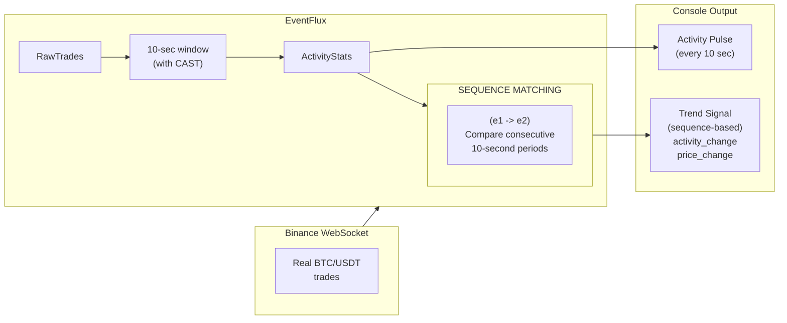

# Real-Time Crypto Trading Demo

Experience EventFlux's **Pattern Processing** with real Bitcoin trades - detect market activity and price trends using continuous pattern matching.

## Quick Start

### 1. Create a new directory

```bash
mkdir eventflux-demo && cd eventflux-demo
```

### 2. Create the query file

Create `query.eventflux` with this content:

```sql title="query.eventflux"
-- EventFlux Advanced Demo: Real-Time Bitcoin Trend Detection
--
-- Demonstrates PATTERN PROCESSING for detecting market activity and price trends
--
-- Architecture:
--   RawTrades (source) ─> ActivityStats (internal) ─┬─> ActivityPulse (sink)
--                                                   └─> TrendSignal (sink)
--
-- Features demonstrated:
--   - WebSocket source with live Bitcoin trades
--   - Tumbling window aggregation (10-second periods)
--   - CAST expression for type conversion (VARCHAR price to DOUBLE)
--   - PATTERN with EVERY for continuous trend detection
--   - Same-stream pattern (e1=Stream -> e2=Stream)
--   - Arithmetic expressions in pattern queries (e2.count - e1.count)
--   - Multi-query pipeline processing

-- =============================================================================
-- STREAMS
-- =============================================================================

-- Source: Real BTC/USDT trades from Binance (no API key required)
CREATE STREAM RawTrades (
    price VARCHAR,
    quantity VARCHAR,
    symbol VARCHAR,
    trade_time BIGINT
) WITH (
    type = 'source',
    extension = 'websocket',
    format = 'json',
    "websocket.url" = 'wss://stream.binance.com:9443/ws/btcusdt@trade',
    "websocket.reconnect" = 'true',
    "websocket.reconnect.max.attempts" = '-1',
    "json.mapping.price" = '$.p',
    "json.mapping.quantity" = '$.q',
    "json.mapping.symbol" = '$.s',
    "json.mapping.trade_time" = '$.T'
);

-- Internal: 10-second activity statistics
-- This stream aggregates raw trades into periodic activity summaries
-- Uses CAST to convert VARCHAR price to DOUBLE for averaging
CREATE STREAM ActivityStats (
    symbol VARCHAR,
    trade_count BIGINT,
    avg_price DOUBLE,
    period_end BIGINT
);

-- Sink 1: Activity pulse - shows each 10-second period's activity and average price
CREATE STREAM ActivityPulse (
    symbol VARCHAR,
    trades BIGINT,
    avg_price DOUBLE
) WITH (
    type = 'sink',
    extension = 'log',
    format = 'json',
    "log.prefix" = '[PULSE]'
);

-- Sink 2: Trend signal - sequence-detected activity and price trends
-- Compares consecutive 10-second periods to detect momentum
CREATE STREAM TrendSignal (
    symbol VARCHAR,
    prev_trades BIGINT,
    curr_trades BIGINT,
    activity_change BIGINT,
    prev_price DOUBLE,
    curr_price DOUBLE,
    price_change_pct DOUBLE
) WITH (
    type = 'sink',
    extension = 'log',
    format = 'json',
    "log.prefix" = '[TREND]'
);

-- =============================================================================
-- QUERIES
-- =============================================================================

-- Query 1: Aggregate raw trades into 10-second activity windows
-- Counts trades per period and calculates average price
-- Uses CAST to convert VARCHAR price to DOUBLE for averaging
INSERT INTO ActivityStats
SELECT
    symbol,
    COUNT(*) AS trade_count,
    AVG(CAST(price AS DOUBLE)) AS avg_price,
    MAX(trade_time) AS period_end
FROM RawTrades
WINDOW('tumbling', 10 SECONDS)
GROUP BY symbol;

-- Query 2: Pass through to activity pulse sink
INSERT INTO ActivityPulse
SELECT
    symbol,
    trade_count AS trades,
    avg_price
FROM ActivityStats;

-- Query 3: PATTERN-BASED TREND DETECTION (Continuous Matching)
-- Uses PATTERN with EVERY to continuously match consecutive 10-second periods
-- Detects if market activity and price are increasing or decreasing
--
-- Pattern: EVERY (e1=ActivityStats -> e2=ActivityStats)
-- - e1 represents the previous period
-- - e2 represents the current period
-- - EVERY enables continuous matching (restarts after each match)
--
-- Note: SEQUENCE would provide strict consecutive matching but currently
-- only matches once. Use PATTERN with EVERY for continuous matching.
--
-- Output:
--   prev_trades: trade count in previous 10-second period
--   curr_trades: trade count in current 10-second period
--   activity_change: difference (positive = increasing activity)
--   prev_price: average price in previous period
--   curr_price: average price in current period
--   price_change_pct: percentage change (positive = price increasing)
INSERT INTO TrendSignal
SELECT
    e2.symbol AS symbol,
    e1.trade_count AS prev_trades,
    e2.trade_count AS curr_trades,
    e2.trade_count - e1.trade_count AS activity_change,
    e1.avg_price AS prev_price,
    e2.avg_price AS curr_price,
    ((e2.avg_price - e1.avg_price) / e1.avg_price) * 100.0 AS price_change_pct
FROM PATTERN (EVERY (e1=ActivityStats -> e2=ActivityStats));
```

### 3. Create the Docker Compose file

Create `docker-compose.yml` with this content:

```yaml title="docker-compose.yml"
services:
  eventflux:
    image: ghcr.io/eventflux-io/eventflux:latest
    container_name: eventflux-crypto-demo
    command: ["/app/query.eventflux"]
    volumes:
      - ./query.eventflux:/app/query.eventflux:ro
    environment:
      - RUST_LOG=info
    restart: unless-stopped
```

### 4. Run the demo

```bash
docker compose up
```

That's it! After ~20 seconds you'll see sequence-detected trend signals flowing.

## What You'll See

The demo outputs two types of data:

**Activity Pulse (every 10 seconds):**
```
[PULSE] {"_timestamp":1703001234567,"symbol":"BTCUSDT","trades":456,"avg_price":43256.78}
[PULSE] {"_timestamp":1703001244567,"symbol":"BTCUSDT","trades":523,"avg_price":43312.45}
```

**Trend Signal (sequence-detected, after 2 periods):**
```
[TREND] {"_timestamp":1703001244567,"symbol":"BTCUSDT","prev_trades":456,"curr_trades":523,"activity_change":67,"prev_price":43256.78,"curr_price":43312.45,"price_change_pct":0.129}
[TREND] {"_timestamp":1703001254567,"symbol":"BTCUSDT","prev_trades":523,"curr_trades":412,"activity_change":-111,"prev_price":43312.45,"curr_price":43298.12,"price_change_pct":-0.033}
```

### Understanding the Output

| Field | Description |
|-------|-------------|
| **_timestamp** | Event processing time (Unix ms) |
| **symbol** | Trading pair (BTCUSDT) |
| **trades** | Trades in the 10-second period |
| **avg_price** | Average price during the period |
| **prev_trades** | Previous period's trade count |
| **curr_trades** | Current period's trade count |
| **activity_change** | Trend indicator (positive = bullish momentum, negative = bearish) |
| **prev_price** | Previous period's average price |
| **curr_price** | Current period's average price |
| **price_change_pct** | Price change percentage (e.g., 0.129 = +0.129%) |

### Interpreting Trends

- **activity_change > 0**: Increasing activity (more trades this period)
- **activity_change < 0**: Decreasing activity (fewer trades this period)
- **price_change_pct > 0**: Price is rising (e.g., +0.5% means half a percent up)
- **price_change_pct < 0**: Price is falling (e.g., -0.2% means two-tenths percent down)
- **Large positive values**: Surge in trading activity (potential breakout)
- **Large negative values**: Sharp decline in activity (potential consolidation)

## Architecture



### Stream Types

| Stream | Type | Purpose |
|--------|------|---------|
| **RawTrades** | Source | Receives real-time trades from Binance WebSocket |
| **ActivityStats** | Internal | Aggregates trades into 10-second activity summaries with average price |
| **ActivityPulse** | Sink | Outputs activity counts and average price per period |
| **TrendSignal** | Sink | Pattern-detected trend comparisons (activity + price) |

### Query Pipeline

1. **Query 1**: Aggregates raw trades into 10-second windows with `CAST(price AS DOUBLE)` for averaging → `ActivityStats`
2. **Query 2**: Passes activity to direct output → `ActivityPulse`
3. **Query 3**: **Pattern matching with EVERY** on consecutive periods → `TrendSignal`

## Pattern Processing Explained

The core innovation in this demo is **continuous pattern matching on consecutive events**:

```sql
INSERT INTO TrendSignal
SELECT
    e2.symbol AS symbol,
    e1.trade_count AS prev_trades,
    e2.trade_count AS curr_trades,
    e2.trade_count - e1.trade_count AS activity_change,
    e1.avg_price AS prev_price,
    e2.avg_price AS curr_price,
    ((e2.avg_price - e1.avg_price) / e1.avg_price) * 100.0 AS price_change_pct
FROM PATTERN (EVERY (e1=ActivityStats -> e2=ActivityStats));
```

### How it works:

1. **Same-stream pattern**: `e1=ActivityStats -> e2=ActivityStats` matches two consecutive events from the same stream
2. **Pattern aliases**: `e1` refers to the previous event, `e2` to the current one
3. **EVERY for continuous matching**: The `EVERY` keyword enables continuous matching - pattern restarts after each match
4. **Arithmetic expression**: `e2.trade_count - e1.trade_count` computes the activity trend
5. **Percentage calculation**: `((e2.avg_price - e1.avg_price) / e1.avg_price) * 100.0` computes price change as a percentage

### CAST Expression for Type Conversion

The Binance API sends prices as strings. EventFlux uses `CAST` to convert them:

```sql
AVG(CAST(price AS DOUBLE)) AS avg_price
```

This converts the VARCHAR price to DOUBLE for numeric averaging.

### Pattern Matching with EVERY

```
Time:     T1           T2           T3           T4
Events:   [Stats1] --> [Stats2] --> [Stats3] --> [Stats4]
                 ↓           ↓           ↓
Matches:    (e1=Stats1, e2=Stats2)
                         (e1=Stats2, e2=Stats3)
                                      (e1=Stats3, e2=Stats4)
```

With `EVERY`, each consecutive pair produces a trend signal, creating a continuous stream of trend data.

## Directory Structure

Your demo directory should look like this:

```
eventflux-demo/
├── docker-compose.yml
└── query.eventflux
```

## Try Different Trading Pairs

Edit `query.eventflux` and change the WebSocket URL:

| Pair | URL |
|------|-----|
| BTC/USDT | `wss://stream.binance.com:9443/ws/btcusdt@trade` |
| ETH/USDT | `wss://stream.binance.com:9443/ws/ethusdt@trade` |
| SOL/USDT | `wss://stream.binance.com:9443/ws/solusdt@trade` |
| XRP/USDT | `wss://stream.binance.com:9443/ws/xrpusdt@trade` |

After editing, restart with:

```bash
docker compose down
docker compose up
```

## Troubleshooting

### No output after 20 seconds

- **Wait for 2 periods**: Sequence needs 2 consecutive events (first TrendSignal after ~20 seconds)
- **Internet connectivity**: Ensure you can reach `stream.binance.com`
- **Firewall**: Some corporate networks block WebSocket connections
- **Region**: Binance may be restricted in some countries

### Container fails to start

```bash
# Pull the latest image
docker pull ghcr.io/eventflux-io/eventflux:latest

# Check for errors
docker compose logs
```

### Permission denied on query file

```bash
chmod 644 query.eventflux
```

## What's Next?

Now that you've seen EventFlux pattern processing in action:

- **[Pattern Reference](/docs/sql-reference/patterns)** - Master pattern syntax and EVERY keyword
- **[Quick Start Guide](/docs/getting-started/quick-start)** - Learn the fundamentals
- **[SQL Reference](/docs/sql-reference/queries)** - Full query language reference
- **[WebSocket Connector](/docs/connectors/websocket)** - Build custom integrations

## Why This Demo?

This demo showcases EventFlux's unique capabilities:

1. **Real-time pattern matching** - Detect trends as they happen
2. **Same-stream patterns** - Compare consecutive events
3. **EVERY for continuous matching** - Pattern restarts after each match
4. **CAST expression** - Type conversion for numeric operations
5. **Pipeline processing** - Chain queries for complex analytics
6. **Zero configuration** - No API keys, just copy-paste and run
